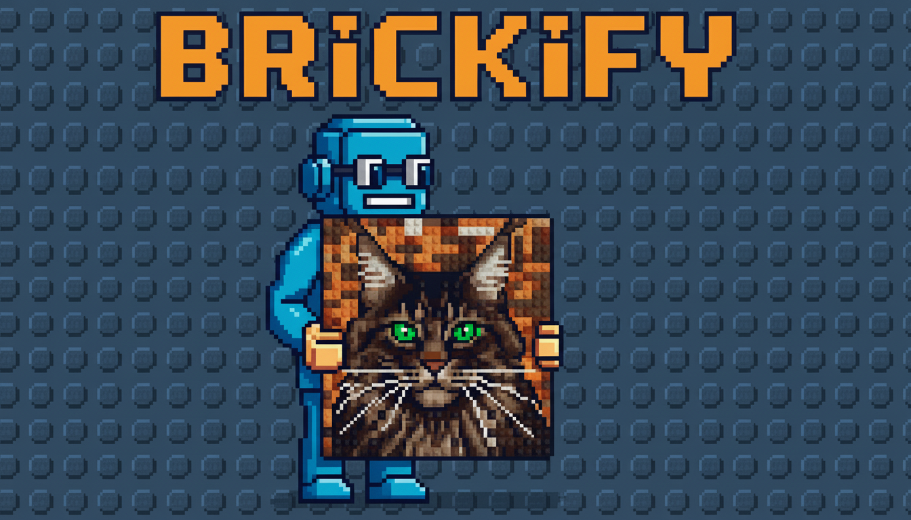
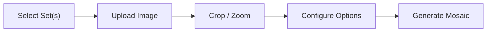

<p align="center">
  
</p>

# 🧱 Brickify (LEGO Mosaic Maker)

Turn any photo into a buildable LEGO Art mosaic. Pick from official LEGO Art sets — or combine multiple sets for richer colors and better results.

<p align="center">
  
</p>

## ✨ Features

- **Multi-Set Blending** — Combine multiple LEGO Art sets (even duplicates) to unlock more colors and pieces. A cart-style UI lets you add sets, adjust quantities, and see merged stats at a glance.
- **Free Mode** — Bypass set constraints entirely. Uses all 38 official LEGO 1×1 round plate colors with unlimited quantity for the highest-fidelity mosaic.
- **Smart Color Matching** — Converts to CIELAB color space for perceptually accurate color mapping, producing mosaics that look natural to the human eye.
- **Color Weights & Exclusion** — Fine-tune the mosaic palette per-color. Exclude any color entirely or boost its influence (up to 3×) using per-color sliders. Boosted colors modulate the perceptual distance metric directly, making them competitive even in regions where they'd otherwise never be chosen. Works in both Realistic and Pop-Art modes.
- **Pop-Art Mode** — Bypass strict color matching and instead map the image's luminance to your assigned LEGO set colors for a highly stylized, high-contrast pop-art mosaic.
- **Floyd-Steinberg Dithering** — Distributes color quantization error across neighboring studs, simulating gradients and smooth transitions even with limited palettes.
- **Image Preprocessing** — Optional contrast enhancement and palette-aware color quantization before mosaic generation, dramatically improving results for low-contrast photos.
- **Interactive Crop & Zoom** — Drag-to-crop with an ultra-precise proportional scroll wheel zoom (desktop) and pinch-to-zoom (mobile). Includes automatic pan boundaries preventing image gap bleed.
- **Reference Comparison Slider** — Dynamically compare your generated mosaic against the color-adjusted source photo with an interactive side-by-side slider and 3D preview options.
- **Responsive & Touch-Optimized** — Fully supports mobile and tablet devices with native-feeling multi-touch gestures and a full-screen, distraction-free crop workspace.
- **Project Saving & Gallery** — Save your progress, including all settings and crop data, to a personal, secure project gallery backed by Firebase Firestore. Return later to tweak or refine your mosaic.
- **Google Photos Picker** — Directly import photos from your Google Photos library with a seamless, privacy-centric OAuth integration.
- **Compare Arena** — Build variants of your photo simultaneously side-by-side. Track differing multi-set configurations, colors modes, preprocessing toggles, and robust gradient mapping with a native custom LEGO color picker. Fully responsive and optimized for all screen sizes.
- **Dynamic Mosaic Resolution** — Intelligently detects and manages non-square target sets (like Floral Art 32x48) passing `target_width` and `target_height` so mosaics process seamlessly without being forced into an invisible 1:1 squashed bounding box.
- **PDF Export** — Generate beautiful, step-by-step building instructions for your custom mosaic as a downloadable PDF file.
- **Admin Dashboard & Access Control** — Secure registration with an admin approval flow. App restricts functionality to approved accounts, and allows admins to review and approve users dynamically.
- **Cloud Infrastructure** — Authenticated Firebase integration with Serverless Cloud Run generation for robust high-res processing and cloud-stored generated media.

## 🛠 Tech Stack

| Layer    | Tech                           |
|----------|--------------------------------|
| Backend  | Python, FastAPI                |
| Frontend | Vanilla HTML/CSS, Alpine.js    |
| Imaging  | Pillow, NumPy                  |
| Package  | uv                             |

No build step middleware. The frontend uses **Alpine.js** via CDN for reactive UI components and is served as static files by FastAPI.

## 🚀 Getting Started

### Prerequisites

- Python ≥ 3.11
- [uv](https://docs.astral.sh/uv/) (recommended) or pip

### Setup

```bash
# Clone the repo
git clone <your-repo-url>
cd lego-mosaic-maker

# Create virtualenv and install dependencies
cd backend
uv sync          # or: python -m venv .venv && source .venv/bin/activate && pip install -e .

# Run the server
source .venv/bin/activate
uvicorn main:app --host 0.0.0.0 --port 8000 --reload
```

Open [http://localhost:8000](http://localhost:8000) in your browser.

### Local Development Mode (Offline)
By default, running the server sets `ENVIRONMENT=development`. This activates "Local Mode", which:
- Bypasses Firebase Authentication (auto-logs you in as a Mock User).
- Bypasses Firebase Cloud Storage.
- Saves all uploaded images, crops, and generated mosaics directly to the internal `backend/uploads/` directory on your hard drive.
- Serves images locally so you can develop and test the entire mosaic engine completely offline.

To run the application in Production mode (which requires valid Firebase credentials):
```bash
ENVIRONMENT=production IS_PRODUCTION=true uvicorn main:app
```

### Testing

The project uses `pytest` for unit testing, encompassing pure logic algorithms and mocked API services.
To run the test suite:

```bash
cd backend
source .venv/bin/activate
pytest
```

## 📖 How It Works



1. **Choose sets** — Click to add LEGO Art sets to your cart. Combine sets for more colors. Use Free Mode for maximum fidelity.
2. **Upload image** — Drop or select a photo.
3. **Crop** — Frame the area you want. Zoom in for detail.
4. **Configure** — Select Color Mode, toggle preprocessing, adjust contrast, and enable dithering.
5. **Generate** — The engine maps each pixel to the nearest LEGO color (in CIELAB space), applies optional dithering, and renders a stud-by-stud mosaic.

## 📂 Project Structure

```
lego-mosaic-maker/
├── .gitignore
├── AGENTS.md        # AI agent instructions & project guidelines (MANDATORY READ)
├── backend/
│   ├── algos/           # Pure functional matrix manipulations
│   ├── features/        # Business logic feature slices (auth, photo, project, mosaic)
│   ├── main.py          # FastAPI server entrypoint
│   ├── mosaic.py        # Legacy mosaic generation engine components
│   ├── lego_sets.py     # Set definitions & merge logic
│   └── pyproject.toml   # Python dependencies
├── frontend/
│   ├── index.html       # Page structure
│   ├── app.js           # UI logic & API integration
│   └── styles.css       # Dark theme styling
└── .gitignore
```

## 🔌 API

| Method | Endpoint               | Description                          |
|--------|------------------------|--------------------------------------|
| GET    | `/api/sets`            | List available LEGO Art sets         |
| GET    | `/api/sets/{id}`       | Get set details (colors, grid, etc.) |
| POST   | `/api/upload`          | Upload a reference image             |
| POST   | `/api/upload/google-photos` | Import image from Google Photos |
| POST   | `/api/crop`            | Crop uploaded image to square        |
| POST   | `/api/generate`        | Generate mosaic from image + set(s)  |
| GET    | `/api/mosaic/{id}`     | Get generated mosaic image           |
| GET    | `/api/projects`        | List saved projects                  |
| POST   | `/api/projects`        | Save a new project                   |
| GET    | `/api/projects/{id}`   | Retrieve a saved project             |
| DELETE | `/api/projects/{id}`   | Delete a saved project               |

### Multi-Set Request Example

```json
{
  "image_id": "abc123",
  "set_selections": [
    { "set_id": "31199", "qty": 1 },
    { "set_id": "31197", "qty": 2 }
  ],
  "dithering": true,
  "preprocessing": true,
  "contrast_boost": 1.5
}
```

## 📜 License

This project is not affiliated with or endorsed by the LEGO Group. LEGO® is a trademark of the LEGO Group.
