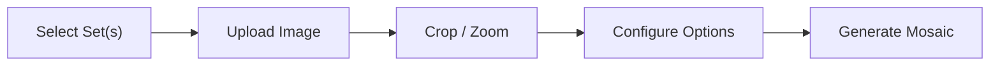

<p align="center">
  
</p>

# 🧱 LEGO Mosaic Maker

Turn any photo into a buildable LEGO Art mosaic. Pick from official LEGO Art sets — or combine multiple sets for richer colors and better results.

## ✨ Features

- **Multi-Set Blending** — Combine multiple LEGO Art sets (even duplicates) to unlock more colors and pieces. A cart-style UI lets you add sets, adjust quantities, and see merged stats at a glance.
- **Free Mode** — Bypass set constraints entirely. Uses all 38 official LEGO 1×1 round plate colors with unlimited quantity for the highest-fidelity mosaic.
- **Smart Color Matching** — Converts to CIELAB color space for perceptually accurate color mapping, producing mosaics that look natural to the human eye.
- **Floyd-Steinberg Dithering** — Distributes color quantization error across neighboring studs, simulating gradients and smooth transitions even with limited palettes.
- **Image Preprocessing** — Optional contrast enhancement and palette-aware color quantization before mosaic generation, dramatically improving results for low-contrast photos.
- **Interactive Crop & Zoom** — Drag-to-crop with a zoom slider (or mousewheel) to frame your subject precisely before converting.
- **Palette Preview** — See exactly how your image maps to the selected LEGO colors before committing to a full mosaic generation.

## 🛠 Tech Stack

| Layer    | Tech                  |
|----------|-----------------------|
| Backend  | Python, FastAPI       |
| Frontend | Vanilla HTML/CSS/JS   |
| Imaging  | Pillow, NumPy         |
| Package  | uv                    |

No frameworks, no build step. The frontend is served as static files by FastAPI.

## 🚀 Getting Started

### Prerequisites

- Python ≥ 3.11
- [uv](https://docs.astral.sh/uv/) (recommended) or pip

### Setup

```bash
# Clone the repo
git clone <your-repo-url>
cd lego-mosaic-maker

# Create virtualenv and install dependencies
cd backend
uv sync          # or: python -m venv .venv && source .venv/bin/activate && pip install -e .

# Run the server
source .venv/bin/activate
uvicorn main:app --host 0.0.0.0 --port 8000 --reload
```

Open [http://localhost:8000](http://localhost:8000) in your browser.

## 📖 How It Works



1. **Choose sets** — Click to add LEGO Art sets to your cart. Combine sets for more colors. Use Free Mode for maximum fidelity.
2. **Upload image** — Drop or select a photo.
3. **Crop** — Frame the area you want. Zoom in for detail.
4. **Configure** — Toggle preprocessing, adjust contrast, enable dithering, and preview the palette mapping.
5. **Generate** — The engine maps each pixel to the nearest LEGO color (in CIELAB space), applies optional dithering, and renders a stud-by-stud mosaic.

## 📂 Project Structure

```
lego-mosaic-maker/
├── backend/
│   ├── main.py          # FastAPI server & API endpoints
│   ├── mosaic.py        # Mosaic generation engine
│   ├── lego_sets.py     # Set definitions & merge logic
│   └── pyproject.toml   # Python dependencies
├── frontend/
│   ├── index.html       # Page structure
│   ├── app.js           # UI logic & API integration
│   └── styles.css       # Dark theme styling
└── .gitignore
```

## 🔌 API

| Method | Endpoint               | Description                          |
|--------|------------------------|--------------------------------------|
| GET    | `/api/sets`            | List available LEGO Art sets         |
| GET    | `/api/sets/{id}`       | Get set details (colors, grid, etc.) |
| POST   | `/api/upload`          | Upload a reference image             |
| POST   | `/api/crop`            | Crop uploaded image to square        |
| POST   | `/api/preview-palette` | Preview palette mapping              |
| POST   | `/api/generate`        | Generate mosaic from image + set(s)  |
| GET    | `/api/mosaic/{id}`     | Get generated mosaic image           |

### Multi-Set Request Example

```json
{
  "image_id": "abc123",
  "set_selections": [
    { "set_id": "31199", "qty": 1 },
    { "set_id": "31197", "qty": 2 }
  ],
  "dithering": true,
  "preprocessing": true,
  "contrast_boost": 1.5
}
```

## 📜 License

This project is not affiliated with or endorsed by the LEGO Group. LEGO® is a trademark of the LEGO Group.
